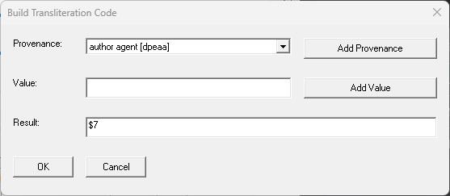

# AddTransliterationCode
An OCLC Connexion Macro for inserting transliteration codes in subfield $7 of a given field.

[InstallAddTransliterationCode.exe](https://github.com/pulibrary/AddTransliterationCode/releases/latest/download/InstallAddTransliterationCode.exe)

## Confugration

**To add a macro to the toolbar**
- Select "Tools > User Tools > Assign...". At the top of the screen, click "Macros". In the list box on the left side of the window, select the desired macro.
- Under the "Select New User Tool" menu, select a tool that is not yet assigned to another function. Make note of the tool number, then click "Assign Tool", and then "OK".
- Select "Tools > Toolbar Editor...". Scroll down to "ToolsUserToolsX", where X is the tool number that you just assigned to the macro. Drag the icon to the desired location on the toolbar.
  
**To assign a keyboard shortcut**
- Select "Tools > Keymaps...". In the "Select Commands for Category" box at the top of the window, select "Macros". Double-click "ScriptShifter", then click the desired macro.
- Click in "Press New Shortcut Key" and press the keyboard shortcut you would like to assign to this macro.
- Make sure that "Shortcut Key Assigned to:" is blank, then click "Assign" and then "OK".

## Usage

Place the cursor in the field to which you want to add the code, then launch the macro either with a keyboard shortcut, or from the User Tools menu.  The following dialog will appear:

This dialog allows you to build the code gradually. Provenance codes can be found in the first dropdown menu, and values can be entered in the text box below it.  One can prefix a value with multiple provenance codes by selecting these from the menu and clicking "add provenance" for each one before entering the value.  Likewise, multiple values can be added for a given provenance by entering each in the text box and clicking "add value" for each one.  Punctuation such as dashes, parentheses, etc. is added automatically.  A preview of the resulting field is shown on the bottom, and this can also be manually edited as needed.  Click "OK" to insert the subfield $7 in the field of the WorldCat record.
